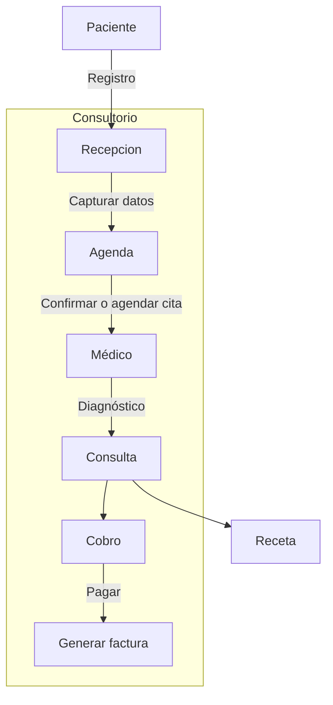
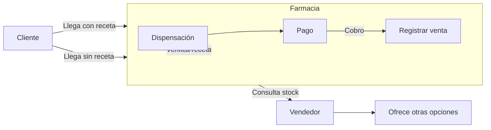
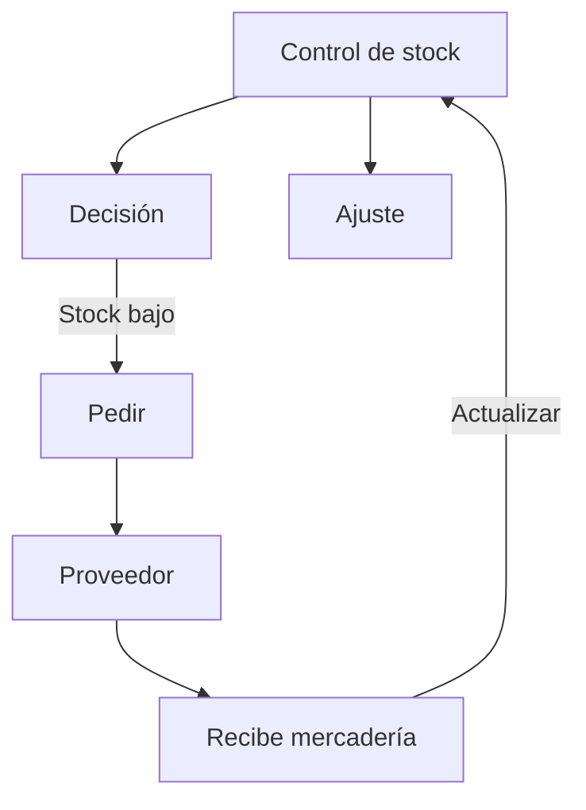

# Contexto Maestro del Dominio Operativo: Consultorios y Farmacias en Guayaquil

## Resumen Ejecutivo  
Guayaquil, con **3.0 millones de habitantes** (febrero 2026)【22†L117-L124】, es la ciudad más poblada de Ecuador. En sus barrios populares (Alborada, Bastión Popular, Florida, etc.) operan numerosos **consultorios médicos y farmacias** locales, además de grandes cadenas. El dólar estadounidense (USD) es la moneda corriente, y se usan principalmente **efectivo y tarjetas** como pago. La población accede a atención básica durante el día (consultorios: ~8h-12h y 14h-18h; farmacias: típicamente 7h-21h) y a servicios extendidos en farmacias 24h (p.ej. Fybeca, Ahorrofarma). La regulación sanitaria (Ley Orgánica de Salud y ARCSA) exige que las farmacias atiendan al público **mínimo 12 horas continuas al día**【20†L157-L160】 y cuenten con personal técnico farmacéutico acreditado.  

En este reporte se describe el ecosistema local, los actores clave (médicos, asistentes, farmacéuticos, pacientes, repartidores, proveedores, regulador), los flujos operativos paso a paso (registro de paciente, agenda/citas, atención, cobro, receta, venta en farmacia, inventarios), así como los **datos mínimos** por entidad y su sensibilidad (p.ej. la LOPDP considera “datos relativos a la salud” como *sensibles*【13†L1-L4】). Se detallan **reglas de negocio** y excepciones habituales (citas duplicadas, stock insuficiente, pacientes sin cédula, urgencias, recetas obligatorias【16†L1-L4】), los puntos de integración entre consultorio y farmacia (descuentos, sincronización de stock, recetas electrónicas), y las **restricciones legales** (permisos de funcionamiento【8†L169-L176】, responsable técnico farmacéutico, protección de datos personales【13†L19-L24】). Se abordan soluciones para operación offline (sin internet, sincronización diferida, backups locales) y se enumeran **preguntas clave** que la IA debe hacer al cliente (horarios, métodos de pago, recetas digitales, lotes/vencimientos, convenios, reportes, etc.).  

Finalmente se incluye un glosario de términos médicos y sanitarios en español, tablas comparativas (ej. venta con vs sin receta, reserva vs venta inmediata) y ejemplos concretos de casos típicos en Guayaquil (p.ej. paciente sin cédula, farmacia sin stock, entrega a domicilio, pedido parcial a proveedor, reprogramación por urgencia, venta bajo receta). Todo está listo para entregar a otra IA: se sugiere producir markdowns con nombres estandarizados (README_dominio, actores_roles.md, flujos.md, etc.) como base documental.

## Ecosistema Local (Guayaquil, barrios populares)  
Guayaquil es una ciudad en crecimiento ordenado【22†L117-L124】. Los consultorios médicos suelen ubicarse en clínicas pequeñas o en locales de barrio. Las **farmacias** pueden ser independientes o cadenas con múltiples sucursales. En barrios como La Alborada, Acacias, Puerto Hondo o Bastión Popular se encuentra gran parte de la población. Las farmacias atienden comúnmente desde las 7–8 AM hasta las 8–9 PM; algunos puntos (p.ej. estaciones de servicio) operan 24h【20†L157-L160】. Se usa el dólar (USD); la mayoría de transacciones son en efectivo, aunque es muy común aceptar tarjetas de débito/crédito y transferencias, dada la urbanización. Las prácticas comerciales incluyen: entrega gratuita de recetas electrónicas en consultorios, planes de descuentos para pacientes frecuentes, y convenios con laboratorios y seguros de salud locales. Los **horarios de trabajo** habituales son: médicos diurnos (de lunes a sábado, a veces con horario partido), mientras que los farmacéuticos pueden turnarse en horario nocturno según la normativa de turnos de farmacia.

## Actores y Roles  
- **Médico/Especialista**: Profesional de salud licenciado (registrado en SENESCYT/Ministerio)【8†L154-L162】. Atiende pacientes, diagnostica, registra atención mínima, emite recetas e indicaciones. Responsabilidades: confidencialidad de datos, emitir recetas válidas, coordinar con farmacias y laboratorios si se requiere (e.g. pruebas de laboratorio). Objetivo: atender salud del paciente y orientar tratamiento.  
- **Asistente Médico/Recepcionista**: Personal de apoyo que registra pacientes, gestiona agendas de citas, recibe pagos menores y canaliza pacientes al médico adecuado. Su rol es operativo: organizar turnos, ingresar datos básicos (nombre, contacto, motivo) y mantener orden en la sala de espera.  
- **Paciente/Cliente**: Individuo que busca atención médica o medicamentos. Puede ser de cualquier edad. Tiene derechos (información, consentimiento) y deberes (veracidad en datos). Su objetivo es recibir diagnóstico y tratamiento. En la práctica se adaptan procedimientos para quienes no llevan cédula (se les asigna identificación provisoria).  
- **Farmacéutico (Responsable Técnico)**: Profesional químico farmacéutico a cargo de la farmacia【16†L1-L4】. Garantiza buenas prácticas en dispensación, controla inventario y verifica recetas. Debe verificar contraindicaciones básicas y orientar al paciente sobre el uso de medicamentos.  
- **Empleado/Vendedor de Farmacia**: Atiende al cliente en mostrador, gestiona ventas OTC (sin receta) y con receta, prepara pedidos para entrega, cobra ventas. Puede ser persona no profesional pero bajo supervisión del farmacéutico.  
- **Repartidor (Delivery)**: Realiza entregas de medicamentos a domicilio. Suelen usar motos/taxis en zonas urbanas densas. Mantiene comunicación (llamadas o WhatsApp) con clientes para coordinar entrega y pago.  
- **Proveedor/Distribuidor**: Empresa o laboratorio que suministra insumos farmacéuticos. Realiza entregas periódicas a consultorios y farmacias, junto con facturas y notas de entrega. Usa vehículos refrigerados según tipo de fármaco. Se encarga de lotes y vencimientos.  
- **Regulador Sanitario (Ministerio de Salud/ARCSA)**: Autoridad estatal que **vigila y controla**: exige permisos de funcionamiento (renovación anual, según ARCSA/MSP), aplicando multas a quienes no cumplan (ej. farmacias deben atender 12h diarias【20†L157-L160】, contactar responsables técnicos). Publica turnos de farmacia de emergencia en feriados.  
- **Seguridad Social/ISSPOL**: En algunos casos, existen convenios con entidades de salud pública o policial para atención especial (no cubiertos aquí).  
- **Otros**: Seguros privados (ScotiaVida, etc.) podrían incluir reembolsos; autoridades municipales para permisos; familiares acompañantes.

## Flujos Operativos Principales

### Flujo 1: Atención en Consultorio

**Pasos**: El paciente llega a recepción, ingresa sus datos (cédula, contacto) y se verifica si ya tiene cita. Se agenda o confirma turno. El médico consulta (anamnesis breve, examina), registra notas importantes (motivo, diagnóstico, síntomas), emite receta/indicaciones y autoriza el pago. Finalmente se cobra y entrega factura.

### Flujo 2: Venta en Farmacia

**Pasos**: El cliente acude a la farmacia (con o sin receta). El vendedor verifica la receta (si existe), despacha el medicamento o recomienda OTC. Se actualiza el stock. El cliente paga (efectivo o tarjeta). Se entrega comprobante. Si no hay stock, se ofrece reserva o alternativa.

### Flujo 3: Gestión de Stock y Proveedores

**Pasos**: De forma periódica (diaria o semanal) se revisa nivel de stock. Si algún producto está por debajo del mínimo, se genera orden de compra al proveedor. Cuando llega la entrega, se verifica cantidad y lotes. Se registra la entrada en el sistema. Se ajusta inventario (FIFO) y se despacha factura al proveedor. Si llega parcialmente, se ajusta pedido pendiente.

## Datos Mínimos por Entidad
Se definen las siguientes entidades con campos esenciales (y nivel de sensibilidad):  

- **Paciente**: `id`, `nombres`, `apellidos` (personales), `cédula/RUC` (identificatorio), `teléfono`, `dirección`, `fecha_nacimiento`. *Sensibilidad*: datos personales básicos; la salud y el historial (parte de Atención) son **sensibles**【13†L1-L4】.  
- **Cita**: `id`, `paciente_id (FK)`, `fecha_hora`, `motivo` (breve, salud sensible), `estado` (Programada, Atendida, Cancelada).  
- **Atención Médica**: `id`, `paciente_id`, `fecha`, `síntomas/diagnóstico` (texto libre, datos sensibles), `receta_id (FK)`.  
- **Cobro/Factura**: `id`, `atención_id`, `monto`, `método_pago` (efectivo/tarjeta), `fecha_pago`. (No se guarda info de tarjeta, solo tipo).  
- **Receta Médica**: `id`, `atención_id`, `medicamentos` (nombre, dosis), `fecha_emisión`. (Datos sensibles de salud).  
- **Producto Farmacia**: `id`, `nombre`, `categoría`, `requiere_receta (sí/no)`, `precio`. (Datos NO personales).  
- **StockMovimiento**: `id`, `producto_id`, `cantidad`, `tipo (ingreso/egreso)`, `fecha`, `lote`, `proveedor_id (FK)`. (Lote/vencimiento para trazabilidad).  
- **Proveedor**: `id`, `nombre`, `RUC`, `teléfono`, `email`. (Datos empresariales; no sensibles personales).  

Los campos que implican salud (diagnósticos, medicamentos) se tratan bajo estricta **confidencialidad y consentimiento**【13†L19-L24】. El sistema debe asegurar que estos datos **solo se usen para atención**, cumpliendo la ley de datos personales. Otros campos son personales (cedula, contacto) que también requieren protección. 

## Reglas de Negocio y Excepciones Frecuentes
- **Agendamiento de citas**: No permitir dos citas solapadas para el mismo profesional. En caso de urgencia, una cita existente puede reprogramarse o cancelarse automáticamente.  
- **Pacientes sin cédula**: Atender igual (registrar datos mínimos). Al obtener cédula se unifican registros.  
- **Atención urgente**: Se prioriza inmediatamente, sin pregunta. Se puede ingresar al sistema luego; según LOPDP, en emergencias de vida el tratamiento de datos sensibles está autorizado para salvar vidas【13†L31-L34】.  
- **Venta con receta vs sin receta**: Algunos medicamentos (controlados) **exigen receta válida**【16†L1-L4】, otros (ibuprofeno, jarabes simples) son OTC.  
- **Stock insuficiente**: Si falta producto, el cliente puede dejar reserva (garantía de compra) o se le sugiere alternativa. Se notifica proveedor.  
- **Devoluciones**: Solo antes de 3 días sin uso. Con receta, se permite anulación solo si receta no ha sido cobrada por farmacia.  
- **Cobro y seguros**: Si existe convenio con seguro o instituciones (ej. ISSFA, ISSEMYM), se aplica descuento o pago diferido según convenio.  
- **Consentimientos**: Para registro de datos sensibles (diagnóstico, imagenología), se debe obtener firma de consentimiento informado.  

## Puntos de Integración Consultorio–Farmacia
- **Intercambio de recetas**: Idealmente, el sistema digitaliza la receta en el consultorio y la farmacia la recibe electrónicamente (mismo sistema o red compartida).  
- **Descuentos internos**: Si consultorio y farmacia pertenecen a la misma red, al ingresar la receta en la farmacia el sistema aplica automáticamente descuentos convenidos.  
- **Sincronización de inventario**: En tiempo real o diario, la farmacia informa al consultorio el nivel de stock (si ambos usan un ERP común). Permite al médico saber si el medicamento recetado está disponible.  
- **Compartir historial**: Con permiso, el consultorio puede consultar historiales de compras en la farmacia (por ejemplo, para seguimiento de pacientes crónicos).  
- **Redes sociales y mensajería**: Algunos locales integran WhatsApp como canal de recordatorio de citas o para notificar disponibilidad de reserva.  

## Restricciones Legales y de Privacidad
- **Permiso de funcionamiento**: Consultorios y farmacias deben obtener el permiso anual del Ministerio de Salud【8†L169-L176】. Por ejemplo, se cita: *“así por ejemplo […] un consultorio dental $7,63; farmacias $22,90”*【8†L169-L176】. Se exige copia de RUC, planos de local, certificados ocupacionales, etc.  
- **Responsable Técnico**: Cada farmacia debe tener un farmacéutico titulado como responsable técnico【16†L1-L4】. Los consultorios requieren al menos un médico con título validado en Ecuador.  
- **Jornada mínima de farmacias**: La Ley Orgánica de Salud obliga a atender 12 horas diarias ininterrumpidas (ej. 8h-20h)【20†L157-L160】. ARCSA publica turnos de farmacia nocturnos para fines de semana y feriados.  
- **Protección de datos personales**: La Ley Orgánica de Protección de Datos Personales (LOPDP) clasifica los datos de salud como sensibles【13†L1-L4】. Estipula que su tratamiento requiere *consentimiento explícito* y confidencialidad estricta (art.30-31). Todo personal debe observar el secreto médico.  
- **Consentimiento informado**: Debe registrarse al menos verbalmente para tratamientos e intervenciones. En casos sin capacidad (niños, emergencias graves) se procede según la normativa (protección de vida primará).  
- **Conservación de registros**: Se recomienda mantener historiales y recetas por 5 años (práctica común, aunque LOPDP no fija plazos exactos). Documentos como recetas con receta oficial deben guardarse al menos el año que dura el permiso.  
- **Otras normativas**: Se aplican Buenas Prácticas de Manufactura (farmacias) y Código de Ética Médica. La normativa ARCSA–MSP es vinculante: multas por incumplimiento de permisos o pérdida de licencia de funcionamiento.  

## Escenarios Offline y Limitaciones de Conectividad
- Dado que algunos consultorios y farmacias operan con conexiones inestables, el sistema debe ser **offline-first**: todas las funciones básicas deben operar localmente (almacenando datos en PC/servidor local) con sincronización posterior cuando hay internet.  
- **Sincronización diferencial**: Al final del día o en horarios de baja demanda se sincronizan datos de pacientes, recetas y stock con servidor central.  
- **Respaldo automático**: Se recomienda backup automático diario en dispositivo USB o nube para prevenir pérdidas (especialmente del historial de pacientes).  
- **Facturación e impresión local**: En caso de fallo de internet, impresoras locales siguen imprimiendo facturas y recetas sin problema.  
- **Pedido y pago móvil**: En zonas con 3G/4G intermitente (p.ej. Huancavilca Norte), los repartidores pueden usar soluciones offline (aplicativos que guardan la orden y luego sincronizan o envían recibos por SMS/WhatsApp).  
- **Formas de pago híbridas**: Si tarjetas no procesan (sin señal), se puede aceptar pago diferido (p.ej. transferencia luego) y marcar la transacción como “pendiente de confirmar”.

## Preguntas Abiertas para el Cliente
1. **Recetas**: ¿Usan recetas impresas tradicionales o un sistema de e-recetas/digital?  
2. **Lotes/Vencimientos**: ¿Requieren llevar registro de lotes y fechas de vencimiento en la farmacia? ¿Cada cuánto actualizan inventario?  
3. **Pagos**: ¿Aceptan todas las tarjetas (Visa, Master, etc.) y transferencias? ¿Cuál es el medio de pago más común?  
4. **Descuentos/Convenios**: ¿Existen convenios con hospitales o seguros que impliquen descuentos o registro especial (ISSPOL, ISSFA)?  
5. **Horarios**: ¿Cuál es la jornada de atención final (incluyendo sábados/domingo)? ¿Mantienen turno de urgencias 24h?  
6. **Seguridad Social**: ¿Operan bajo algún sistema de salud pública (Seguro Social, ISSEMYM)? ¿Cómo registran atenciones?  
7. **Pedidos de farmacia**: ¿Cómo se comunica la receta del consultorio a la farmacia si están separados?  
8. **Reportes Requeridos**: ¿Necesitan reportes regulares (por ejemplo, stock bajo, ventas diarias, clientes frecuentes, utilidades)?  
9. **Política de devoluciones**: ¿Tienen plazos o condiciones específicas más allá de las legales?  
10. **Citas/Teléfono**: ¿Usan llamadas, WhatsApp u otro medio para coordinar citas/reservas?  

## Glosario de Términos  
- **Cita/Turno**: Reservación programada para consulta médica.  
- **Consulta Médica/Atención**: Acto de examinar al paciente y brindar un diagnóstico o tratamiento.  
- **Receta Médica**: Instrucción escrita del médico para dispensar medicamentos.  
- **Dispensación**: Entrega del medicamento por el farmacéutico.  
- **Stock/Inventario**: Cantidad disponible de cada producto en la farmacia.  
- **Proveedor**: Empresa o laboratorio que suministra medicamentos e insumos.  
- **Farmacéutico Responsable**: Químico encargado del cumplimiento normativo en farmacia.  
- **Permiso de Funcionamiento**: Autorización sanitaria oficial para operar.  
- **Paciente**: Persona que recibe atención o adquiere medicamentos.  
- **Datos sensibles**: Información personal de salud que requiere protección especial【13†L1-L4】.  
- **Convenio**: Acuerdo con aseguradoras u organizaciones para descuentos o pagos especiales.

## Comparativas Relevantes

| **Venta con receta**            | **Venta sin receta (OTC)**                  |
|--------------------------------|---------------------------------------------|
| Requiere receta válida (Ley)【16†L1-L4】 | No requiere receta (medicamentos libres)     |
| Atendida siempre por farmacéutico | Puede ser autoservicio (p.ej. gel antibac)   |
| Registro en historial médico y farmacia | Registro solo en farmacia                   |
| Descuento posible (fidelización) | Pago normal                                    |

| **Reserva de producto**          | **Venta inmediata**                          |
|----------------------------------|---------------------------------------------|
| Se aparta producto pendiente de llegada | Se entrega al instante si hay stock      |
| Cliente deja garantía (50%) o firma compromiso | Cliente paga 100% y recibe en el acto |
| Útil para productos importados o alto costo | Productos comunes en estante           |
| P.ej. medicamento importado bajo pedido | P.ej. paracetamol disponible en mostrador |

## Casos Típicos en Guayaquil
1. **Paciente sin cédula llega a un consultorio** (Barrio Las Acacias): Se registra como “Juanito Pérez”, 32 años, sin cédula. El doctor atiende cefalea, receta analgésicos. Se cobra con tarjeta, se anota “cedula desconocida”. La próxima cita se actualiza con su cédula al traerla.  
2. **Farmacia local sin stock del medicamento** (CDLA Alborada): Paciente con receta de amoxicilina. La farmacia no lo tiene; el vendedor propone esperarlo o cambiar por equivalencia genérica. El cliente prefiere reservar la marca. Se deja nombre y se le llama cuando llega (llegó en 3 días).  
3. **Venta con receta a domicilio** (Sector Kennedy): Señor mayor necesita cardiotrópicos. El ayudante médico toma la receta y la farmacia la despacha por delivery. El enfermero acompaña el pago en efectivo ($0 de flete) y luego firma acuse de recibo.  
4. **Entrega parcial de proveedor** (Barrio Puerto Hondo): Se pidió 100 fajas especiales, pero solo llegan 60. Se actualiza inventario con 60, se paga 60. El resto se deja como pedido pendiente. Se agenda nueva entrega para la semana siguiente.  
5. **Cita reprogramada por emergencia** (Centro Médico San Francisco): Paciente tenía cita de 10h. A las 9:45 avisó “llegaré tarde” por fiebre alta, luego arribó mareado; se le atiende de urgencia. La cita original se cancela. El médico receta antibióticos tras estabilizarlo.  
6. **Paciente compra medicamento recetado** (Farmacia El Médico, Centro): Entrega receta de 30 tabletas de metformina. Farmacéutico verifica dosis con doctor (medicamento controlado). Entrega 30 unidades, cobra y registra la venta con lote y vencimiento correspondiente.

## Documentación Sugerida (MarkDown)  
A continuación, el **README de dominio** junto con un índice de archivos propuesto para la documentación técnica completa:

```markdown
# Resumen del Dominio: Consultorio + Farmacia

## Contenido
- `README_dominio.md` (este archivo, resumen general del dominio)
- `actores_roles.md` (descripción de actores y funciones)
- `flujos.md` (diagramas y pasos de procesos operativos)
- `datos_minimos.md` (campos esenciales y sensibilidad)
- `reglas_negocio.md` (normativas internas y excepciones)
- `integraciones.md` (conexiones consultorio–farmacia)
- `legal_privacidad.md` (permisos, leyes, LOPDP con referencias)
- `offline_soluciones.md` (sincronización y respaldo)
- `preguntas_cliente.md` (lista de consultas al cliente)
- `glosario.md` (términos técnicos y sanitarios)
- `casos.md` (mini-casos reales/exemplos del dominio)

## Árbol de Archivos
```
consultorio_farmacia_dominio/
  README_dominio.md
  actores_roles.md
  flujos.md
  datos_minimos.md
  reglas_negocio.md
  integraciones.md
  legal_privacidad.md
  offline_soluciones.md
  preguntas_cliente.md
  glosario.md
  casos.md
```

Este índice facilita a otra IA generar documentos separados, cubriendo cada aspecto (escenario, datos, reglas, etc.) de forma ordenada.

```

[Descargar Contexto de Dominio con índice (Markdown)](sandbox:/mnt/data/contexto_dominio_y_indice.md)

**Fuentes:** Ley Orgánica de Salud y ARCSA (turnos 12h)【20†L157-L160】; Ministerio de Salud Pública (permisos y tarifas)【8†L169-L176】; Ley Orgánica de Protección de Datos Personales (datos de salud sensibles)【13†L1-L4】【13†L19-L24】; Alcaldía de Guayaquil (población)【22†L117-L124】. Estos datos están en documentos oficiales en español, complementados con prácticas observadas localmente.