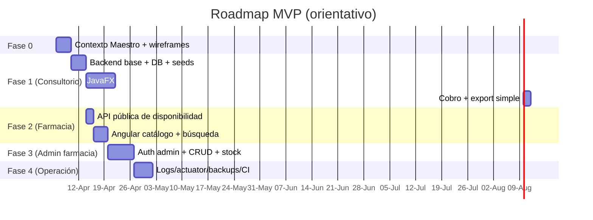
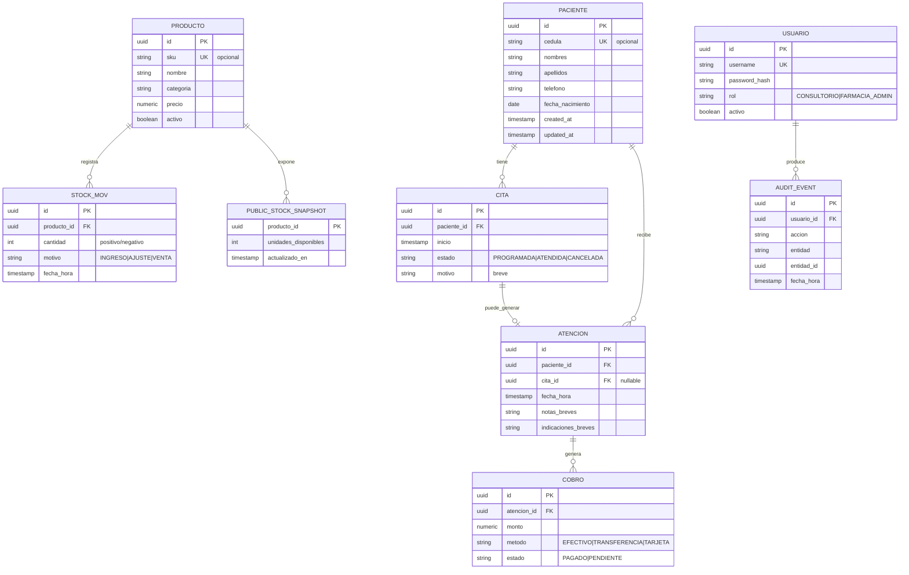
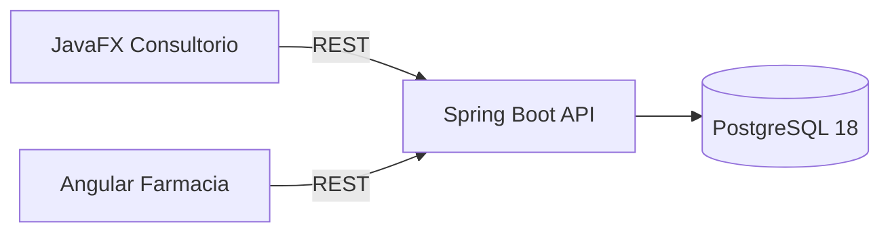
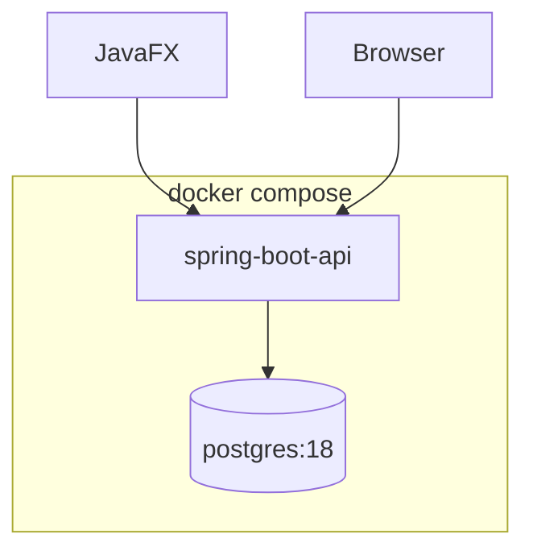

# Contexto Maestro y paquete documental fundacional para un MVP híbrido de consultorio y farmacia en Guayaquil

## Resumen ejecutivo

Este informe define un **Contexto Maestro** y un **paquete documental fundacional** para un MVP híbrido (consultorio médico pequeño + farmacia integrada) orientado a un entorno de barrio en entity["city","Guayaquil","guayas, ecuador"], entity["country","Ecuador","country"]. El sistema se separa en dos experiencias: **consultorio internalista** (desktop **JavaFX**) para uso del médico/asistente y **farmacia** (web **Angular**) para **consulta pública de disponibilidad** (MVP) con crecimiento posterior hacia administración y pedidos internos. La prioridad de UX es un **usuario mayor/no técnico**, por lo que se enfatiza legibilidad, flujos lineales y lenguaje no técnico, alineado con recomendaciones de accesibilidad para usuarios mayores (W3C WAI) y hallazgos de usabilidad (NN/g). citeturn8view5turn1search2turn1search6

A nivel de stack, se valida y documenta un baseline actual (fecha de referencia local: **2026-04-06**): **Spring Boot 4.x** (página oficial muestra 4.0.5), **PostgreSQL 18.x** (release mayor en 2025-09-25, con 18.0/18.1/18.2/18.3), y compatibilidades de **Angular 21** (tabla oficial de compatibilidad con Node/TypeScript/RxJS). citeturn8view2turn0search10turn0search6turn8view1

El documento incluye además un enfoque explícito de **privacidad**: en Ecuador, los **datos de salud** se consideran datos relativos a la salud y además **“datos sensibles”** (incluye “salud”), con obligaciones de confidencialidad y medidas técnicas/organizativas, además del principio “protección de datos desde el diseño y por defecto” en la ley. Esto condiciona la arquitectura: **fuerte frontera** entre lo “público” (farmacia) y lo “sensible” (consultorio). citeturn9view1turn9view2

**Descarga**: se generó un archivo semilla en Markdown (README + índice maestro) listo para copiar a otro chat GPT o convertir a PDF:  
[Descargar `contexto_maestro_y_indice.md`](sandbox:/mnt/data/contexto_maestro_y_indice.md)

## Contexto del MVP y alcance en Guayaquil

El producto se concibe como “software administrativo pequeño y escalable por fases”. La motivación conversada es doble: (a) entregar valor tangible rápido (demo convincente para un usuario no técnico) y (b) construir un activo reutilizable de portafolio replicable (mismo tipo de producto, distintos dominios), reduciendo la fricción técnica al repetir Java/JavaFX.

**Comparativa de superficies UX (desktop vs web)**

| Criterio | Consultorio (JavaFX Desktop) | Farmacia (Angular Web) |
|---|---|---|
| Perfil de usuario | Médico/asistente, baja afinidad tecnológica | Cliente del barrio (consulta rápida) + futuro admin farmacia |
| Ritmo de uso | Alta frecuencia interna (agenda diaria) | Acceso esporádico, “¿hay X ahora?” |
| Offline-friendly | Alto (se puede operar local/LAN) | Medio (depende del hosting/red) |
| Complejidad de seguridad | Alta (datos sensibles) | Media en MVP (catálogo/stock), sube con cuentas/pedidos |
| Update/Soporte | Instalación local + updates controlados | Deploy centralizado y actualizaciones rápidas |
| “Demostrabilidad” | Muy alta si UI es sobria y directa | Alta para “consulta pública” y crecimiento |

**Fases MVP (estimación orientativa para un solo dev en vacaciones)**  
*(Estimación no contractual; ajústala al tiempo real y al feedback del usuario.)*

| Fase | Objetivo | Entregables | Tiempo orientativo |
|---|---|---|---|
| Fase 0 | Alinear dominio + demo narrativa | Docs fundacionales + wireframes + seeds plan | 2–4 días |
| Fase 1 | Consultorio usable | JavaFX (pacientes/agenda/atención/cobro) + API + DB | 7–14 días |
| Fase 2 | Farmacia consultable | Angular catálogo + endpoints públicos de stock | 4–7 días |
| Fase 3 | Admin farmacia | Login admin + CRUD productos + stock | 5–10 días |
| Fase 4 | Operación mínima | Logs/auditoría/backups/CI básico | 3–7 días |

**Roadmap en Mermaid (vista rápida)**



## Dominio y flujos operativos

El dominio se modela como **dos contextos** que comparten local físico pero no necesariamente comparten toda la data:

- **Contexto Consultorio**: agenda, pacientes, atención, receta/indicaciones simples, cobro.
- **Contexto Farmacia**: catálogo, stock, movimientos simples de stock, (opcional) ventas internas.

La frontera es crítica por privacidad: la ley ecuatoriana incluye “salud” dentro de “datos sensibles” y define datos relativos a la salud; además impone deber de confidencialidad y medidas de seguridad, incluyendo “protección desde el diseño y por defecto”. citeturn9view1turn9view2

**Actores principales**
- **Médico** (usuario mayor/no técnico): quiere ver agenda, registrar atención y cobrar sin fricción.
- **Asistente** (si existe): registra pacientes, agenda citas, imprime/entrega indicaciones.
- **Administrador Farmacia** (interno): actualiza stock/catalogo (fase 3).
- **Cliente público** (web): consulta disponibilidad (fase 2).

**Flujos MVP clave**
- Consultorio: registrar paciente → agendar cita → atender → registrar cobro → (opcional) imprimir indicaciones.
- Farmacia: buscar producto → ver disponibilidad actual (unidades) → (futuro) generar solicitud interna.

**Diagrama de flujo de usuarios (Mermaid)**

```mermaid
flowchart LR
  subgraph Consultorio [Consultorio - JavaFX]
    A[Lista de citas del día] --> B[Buscar/crear paciente]
    B --> C[Registrar atención simple]
    C --> D[Registrar cobro]
    C --> E[Imprimir indicaciones]
  end

  subgraph Farmacia [Farmacia - Angular]
    F[Catálogo público] --> G[Buscar "vitamina C"]
    G --> H[Ver disponibilidad: 5 unidades]
  end

  D -->|opcional futuro| I[Referencia a compra en farmacia]
  I --> H
```

## Arquitectura y system design

### Validación de stack y versiones base

- **Angular 21** aparece como versión bajo soporte activo con tabla oficial de compatibilidades (Node/TS/RxJS). citeturn8view1  
- **Spring Boot 4.x**: la página oficial del proyecto muestra versión 4.0.5 y blog oficial anuncia 4.0.0 (2025-11-20) con compatibilidad Java 17+ y cambios mayores del portfolio. citeturn8view2turn7search2  
- **PostgreSQL 18**: release mayor en 2025-09-25; release notes oficiales e historial 18.0/18.1/18.2/18.3; incluye `uuidv7()` para UUIDs ordenables por tiempo. citeturn0search10turn0search6turn8view3  
- **JavaFX**: plataforma open source para aplicaciones cliente; documentación de OpenJFX para “getting started”. citeturn2search3turn2search0  
- **Docker Compose**: define y ejecuta apps multi-contenedor y la referencia oficial describe `compose.yml` y componentes como servicios/redes/volúmenes. citeturn2search4turn2search1turn2search7

### Backend único modular vs backends separados

| Aspecto | Backend único modular (recomendación habitual MVP) | Backends separados (consultorio vs farmacia) |
|---|---|---|
| Velocidad de entrega | Más rápida (menos duplicación) | Más lenta (duplicación de auth, infra, libs) |
| Complejidad operativa | Menor (1 deploy, 1 runtime principal) | Mayor (2 deploys, 2 pipelines, 2 configs) |
| Riesgo de mezclar dominios | Mitigable con módulos + rutas + roles + segmentación de red | Menor por construcción (frontera dura) |
| Seguridad | Requiere muy buena política de exposición (qué rutas se publican) | Facilita aislar consultorio en LAN y farmacia pública |
| Escalabilidad futura | Modular → luego se puede separar si conviene | Ya separado desde el inicio |
| Observabilidad | Centralizada (logs/metrics/traces) citeturn2search15 | Separada (más esfuerzo de correlación) |

**Recomendación práctica para este caso**:  
- Si el objetivo es **demo + MVP rápido** y el entorno es pequeño, iniciar con **backend único modular** con “áreas” (`/consultorio`, `/farmacia`, `/public`) y políticas de red/reverse proxy para exponer solo `/public` (y luego `/farmacia/admin`).  
- Si desde el inicio se prevé hosting público real para farmacia, y consultorio debe quedar estrictamente en LAN, backends separados también son válidos, pero suben costo inicial.

### Diseño lógico propuesto

- **Capa API**: Controllers REST por contexto (Consultorio/Farmacia/Public).
- **Capa Aplicación**: casos de uso (Services) con transacciones y validación.
- **Dominio**: entidades y reglas (médico/farmacia), excepciones de dominio.
- **Infra**: repositorios JPA, mapeos, adaptadores (correo, impresión, etc.).

Para **observabilidad**, Spring Boot define observabilidad como logs+metrics+traces y usa Micrometer Observation para métricas/trazas. citeturn2search15  
Para **logging**, Spring Boot provee configuración por defecto y deja abierta la implementación (Logback/Log4j2/Jul). citeturn2search2turn2search5

**Despliegue local reproducible** con Docker Compose (PostgreSQL + backend + opcional reverse proxy). citeturn2search4turn2search1

**Diagrama de despliegue (Mermaid)**

```mermaid
flowchart TB
  subgraph UserDevices["Dispositivos"]
    JFX["PC consultorio (JavaFX)"]
    WEB["Cliente (navegador)"]
    ADMIN["Admin farmacia (navegador)"]
  end

  subgraph LocalNet["Entorno (LAN o servidor/VPS)"]
    RP["Reverse Proxy (Nginx/Caddy)"]
    API["Spring Boot 4 API"]
    DB["PostgreSQL 18"]
  end

  WEB -->|HTTPS /public/*| RP
  ADMIN -->|HTTPS /farmacia/admin/*| RP
  JFX -->|HTTP(S) /consultorio/*| API

  RP --> API
  API --> DB
```

## Datos, API y seguridad

### Privacidad y límites por ley

La Ley Orgánica de Protección de Datos Personales (Registro Oficial Suplemento 459, 26-may-2021) define “datos sensibles” incluyendo “salud” y define “datos relativos a la salud” como datos sobre salud física/mental, incluida la prestación de servicios sanitarios. citeturn8view6turn9view1  
Además establece principios como confidencialidad (sigilo, secreto, medidas técnicas/organizativas) y obligaciones vinculadas a seguridad y “protección desde el diseño y por defecto”. citeturn9view2  
Para diseño MVP: minimiza y separa. En v1, el consultorio puede guardar **nota administrativa breve**, no una historia clínica extensa; y la farmacia pública solo expone **stock agregado**, nunca datos de pacientes.

### Modelo ER propuesto (Mermaid)

Este ER está pensado para: agenda, atención simple, cobro, y catálogo/stock simple. Se proponen IDs `uuid` con default `uuidv7()` (PostgreSQL 18 lo incorpora). citeturn8view3



### Contratos API y errores estándar

**API pública**: `GET /public/productos?query=vitamina%20c` devuelve lista con unidades disponibles, sin autenticación.  
**API privada farmacia**: Admin CRUD productos/stock con autenticación.  
**API privada consultorio**: pacientes/citas/atención/cobro con autenticación y/o restricción de red.

Para errores, se recomienda el estándar **Problem Details** (RFC 9457), que define un formato JSON estable para errores en APIs HTTP. citeturn5search0turn5search3  
Para seguridad web, Angular documenta explícitamente prácticas contra XSS y CSRF, y `provideHttpClient` indica que HttpClient viene configurado con opciones por defecto de protección XSRF, lo que ayuda pero no reemplaza validación server-side. citeturn3search6turn3search19  
Para APIs, OWASP API Security Top 10 2023 resume riesgos como autorización a nivel de objeto/propiedad y errores de configuración. citeturn5search5turn5search20

### Operación mínima y backups

PostgreSQL documenta **tres enfoques** de backup (SQL dump, filesystem, continuous archiving) y herramientas como `pg_dump` + `pg_restore` para dumps flexibles. citeturn6search8turn6search0turn6search4  
Se puede añadir PITR (WAL archiving) cuando el sistema sea crítico; la doc oficial describe requisitos (`wal_level`, `archive_mode`, `archive_command`). citeturn6search1turn6search9

## Paquete documental producido en Markdown

Esta sección “materializa” el paquete en archivos Markdown copiables. Los URLs van dentro de los archivos para que otro chat GPT (o un generador de PDFs) tenga referencias directas.

### Documento de contexto (README maestro)

```markdown
<!-- File: docs/00_contexto_maestro/README.md -->
# MVP híbrido: Consultorio + Farmacia (Guayaquil)

## Executive summary
Sistema híbrido para un consultorio de barrio con farmacia en el mismo local:
- **Consultorio**: app **JavaFX** interna (pacientes, agenda, atención simple, cobro).
- **Farmacia**: app **Angular** (MVP: catálogo + disponibilidad pública en tiempo real/simple).

Público objetivo principal: **usuario mayor/no técnico**.  
Decisión personal del autor: **repetir tipo de producto administrativo** en Java/JavaFX (más que diversificar lenguajes) para consolidar base técnica y reutilizar componentes.

## Stack objetivo (baseline)
- Java 21 (Eclipse Temurin LTS): https://adoptium.net/temurin/releases/?version=21
- Spring Boot 4 (ref docs): https://docs.spring.io/spring-boot/index.html
- PostgreSQL 18 (docs/release notes): https://www.postgresql.org/docs/release/
- JavaFX (OpenJFX docs): https://openjfx.io/openjfx-docs/
- Angular (docs): https://angular.dev/
- Docker Compose: https://docs.docker.com/compose/

Compatibilidad Angular (Node/TS/RxJS): https://angular.dev/reference/versions  
Logging Spring Boot: https://docs.spring.io/spring-boot/reference/features/logging.html  
Observability Spring Boot: https://docs.spring.io/spring-boot/reference/actuator/observability.html  

## Alcance v1 (MVP)
### Consultorio (JavaFX)
- CRUD Paciente (datos mínimos).
- Agenda (citas del día, estados).
- Atención simple (nota breve + indicaciones).
- Cobro (monto, método, estado).
- Export básico (CSV) opcional.

### Farmacia (Angular)
- Catálogo público con búsqueda.
- Vista de detalle de producto.
- Endpoint público que devuelve: `unidades_disponibles` y `actualizado_en`.
- Sin login cliente, sin carrito, sin pedidos, sin pagos.

### Backend y DB
- PostgreSQL 18.
- API REST con rutas segregadas:
  - `/consultorio/**` (privado)
  - `/farmacia/**` (privado, admin)
  - `/public/**` (público)
- Seeds para demo.

## Fuera de alcance v1
- Historia clínica compleja y adjuntos.
- Integración con facturación electrónica.
- Pedidos, pagos, delivery.
- Multi-sucursal.

## Riesgos y mitigaciones
- Riesgo: exponer datos sensibles por error.
  - Mitigación: separación fuerte de rutas, roles, DTOs seguros, tests de autorización.
- Riesgo: UX difícil para usuario mayor.
  - Mitigación: tipografía grande, flujo lineal, texto claro, 1 acción por pantalla clave.

## Glosario mínimo
- Paciente, Cita, Atención, Cobro, Producto, Stock, Disponibilidad pública.

## Roadmap (alto nivel)
- Fase 0: docs + wireframes + seeds plan.
- Fase 1: consultorio (JavaFX + backend + DB).
- Fase 2: farmacia pública (Angular + endpoints públicos).
- Fase 3: admin farmacia (auth + CRUD + stock).
- Fase 4: operación (logs, auditoría, backups, CI).

```

### Documento de dominio y flujos operativos

```markdown
<!-- File: docs/01_dominio/dominio_y_flujos.md -->
# Dominio y flujos operativos (Consultorio + Farmacia)

## Objetivo del documento
Aterrizar el flujo real de trabajo para construir un MVP usable y demostrable.
Enfatiza:
- datos mínimos
- reglas del negocio
- límites de privacidad
- casos de uso MVP

## Actores
- Médico (usuario mayor/no técnico)
- Asistente (opcional)
- Admin farmacia
- Cliente público (web)

## Principios de privacidad (Ecuador)
**Salud** es dato sensible; evitar exposiciones.
Referencia legal (para el equipo):
- Ley Orgánica de Protección de Datos Personales (Registro Oficial Suplemento 459, 26-may-2021):
  - PDF (texto): https://www.finanzaspopulares.gob.ec/wp-content/uploads/2021/07/ley_organica_de_proteccion_de_datos_personales.pdf
- Reglamento general (13-nov-2023): https://www.cosede.gob.ec/wp-content/uploads/2023/12/REGLAMENTO-GENERAL-A-LA-LEY-ORG%C3%81NICA-DE-PROTECCION-DE-DATOS-PERSONALES_compressed-1.pdf
- Política MSP (referencia de buenas prácticas): https://www.salud.gob.ec/politica-datos-personales/

## Módulos (MVP)
### Consultorio (JavaFX)
- Pacientes
- Agenda/Citas
- Atención simple
- Cobro

### Farmacia (Angular)
- Catálogo público
- Disponibilidad pública (unidades)
- (Futuro) admin: productos y stock

## Datos mínimos por entidad
### Paciente
- nombres, apellidos
- teléfono (opcional pero útil)
- cédula (opcional)
- fecha nacimiento (opcional)
- notas internas no clínicas (opcional)

### Cita
- paciente
- fecha/hora inicio
- estado: PROGRAMADA | ATENDIDA | CANCELADA
- motivo (breve)

### Atención
- fecha/hora
- notas breves (evitar diagnóstico extenso en MVP)
- indicaciones breves
- vínculo opcional a cita

### Cobro
- monto
- método: EFECTIVO | TRANSFERENCIA | TARJETA
- estado: PAGADO | PENDIENTE

### Producto (farmacia)
- nombre
- categoría
- precio
- activo
- stock actual (derivado de movimientos o snapshot)

## Reglas de negocio (MVP)
- No se puede registrar cobro sin atención.
- Una cita puede existir sin atención (si se canceló o está pendiente).
- Atención puede existir sin cita (paciente llegó sin agendar).
- Stock público muestra unidades agregadas sin información de quién compra.

## Casos de uso (resumen)
- UC-001 Registrar paciente
- UC-002 Agendar cita
- UC-003 Registrar atención
- UC-004 Registrar cobro
- UC-005 Consultar disponibilidad pública (producto)
- UC-006 Admin: crear/editar producto (fase 3)
- UC-007 Admin: ajustar stock (fase 3)

## Flujos principales (texto)
### Flujo consultorio (día típico)
1) Abrir “Agenda del día”.
2) Buscar paciente o crear paciente.
3) Registrar atención (nota breve + indicaciones).
4) Registrar cobro.
5) (Opcional) imprimir indicaciones.

### Flujo farmacia (cliente)
1) Abrir web.
2) Buscar producto.
3) Ver disponibilidad: “5 unidades disponibles” + “actualizado: hh:mm”.

## Ejemplos de pantallas requeridas (3-5)
Consultorio:
- Agenda del día
- Form paciente (alta/edición)
- Atención (nota breve)
- Cobro (monto/método/estado)

Farmacia:
- Catálogo/búsqueda
- Detalle de producto (incluye stock)

```

### Arquitectura y system design

```markdown
<!-- File: docs/02_arquitectura/system_design.md -->
# Arquitectura y system design

## Objetivo
Definir una arquitectura mínima robusta para:
- MVP rápido
- separación consultorio vs farmacia
- escalabilidad gradual (sin rehacer todo)
- operación reproducible (Docker Compose)
- observabilidad mínima

## Opción A: Backend único modular (recomendado para MVP)
- Un solo servicio Spring Boot.
- Paquetes/módulos por contexto:
  - `consultorio.*`
  - `farmacia.*`
  - `public.*`
- Seguridad y exposición por ruta/rol + reverse proxy.

Ventajas:
- menos duplicación
- 1 deploy
- más rápido para MVP

Riesgos:
- mala configuración podría exponer endpoints sensibles
Mitigación:
- tests de autorización, DTOs “seguros”, segmentación de red

## Opción B: Backends separados
- `backend-consultorio` (privado LAN)
- `backend-farmacia` (público/admin)

Ventajas:
- frontera dura por construcción
Riesgos:
- duplicación (auth, logging, config)
- coordinación de DB/contratos

## Recomendación
Para demo + MVP: Opción A.
Se puede evolucionar a Opción B si:
- farmacia se vuelve pública real
- consultorio debe quedar aislado estrictamente

## Datos y IDs
- PostgreSQL 18 soporta uuidv7() (UUID ordenable por tiempo) -> ideal para PK.
Release notes: https://www.postgresql.org/docs/release/18.0/

## Capas (Clean/Hexagonal liviana)
- API (controllers)
- Application (use cases/services)
- Domain (entities, rules, domain exceptions)
- Infrastructure (repositories, db, adapters)

## Observabilidad
Spring Boot Observability: https://docs.spring.io/spring-boot/reference/actuator/observability.html
Logging: https://docs.spring.io/spring-boot/reference/features/logging.html
Actuator endpoints: https://docs.spring.io/spring-boot/reference/actuator/endpoints.html

## Diagramas Mermaid
### Componentes


### Despliegue local (Docker Compose)


## Perfiles de entorno
- `local`: compose + seeds demo
- `demo`: datos demo + logging más detallado
- `prod`: secrets por env, backups, tls, hardening

## Estructura de repo (alineada a conversación)
```
consultorio-farmacia/
  database/
  backend/ (o backend-consultorio + backend-farmacia)
  desktop-consultorio-javafx/
  storefront-farmacia-angular/
  docs/
  infra/
```

```

### Diseño de base de datos y seeds SQL

```markdown
<!-- File: docs/03_base_datos/modelo_ER.md -->
# Modelo ER y esquema inicial (PostgreSQL 18)

## Notas de diseño
- PK como `uuid` con default `uuidv7()`.
- Auditoría mínima: `created_at`, `updated_at`, `created_by` (si aplica).
- Evitar PHI (información clínica sensible) excesiva en MVP.

## Extensiones
- `uuid-ossp` si se usa uuid_generate_* (opcional)
- En PG18: uuidv7() ya existe (ver release 18.0)

## DDL sugerido (mínimo)
```sql
-- File: database/initdb/01_init_schema.sql
create schema if not exists consultorio;
create schema if not exists farmacia;

-- Paciente
create table if not exists consultorio.paciente (
  id uuid primary key default uuidv7(),
  cedula varchar(20) unique,
  nombres varchar(120) not null,
  apellidos varchar(120) not null,
  telefono varchar(30),
  fecha_nacimiento date,
  created_at timestamptz not null default now(),
  updated_at timestamptz not null default now()
);

-- Cita
create table if not exists consultorio.cita (
  id uuid primary key default uuidv7(),
  paciente_id uuid not null references consultorio.paciente(id),
  inicio timestamptz not null,
  estado varchar(20) not null,
  motivo varchar(200),
  created_at timestamptz not null default now(),
  updated_at timestamptz not null default now()
);

-- Atención
create table if not exists consultorio.atencion (
  id uuid primary key default uuidv7(),
  paciente_id uuid not null references consultorio.paciente(id),
  cita_id uuid references consultorio.cita(id),
  fecha_hora timestamptz not null default now(),
  notas_breves text,
  indicaciones_breves text,
  created_at timestamptz not null default now(),
  updated_at timestamptz not null default now()
);

-- Cobro
create table if not exists consultorio.cobro (
  id uuid primary key default uuidv7(),
  atencion_id uuid not null references consultorio.atencion(id),
  monto numeric(12,2) not null check (monto >= 0),
  metodo varchar(30) not null,
  estado varchar(20) not null,
  created_at timestamptz not null default now()
);

-- Producto
create table if not exists farmacia.producto (
  id uuid primary key default uuidv7(),
  sku varchar(40) unique,
  nombre varchar(200) not null,
  categoria varchar(80),
  precio numeric(12,2) not null check (precio >= 0),
  activo boolean not null default true,
  created_at timestamptz not null default now(),
  updated_at timestamptz not null default now()
);

-- Movimientos de stock
create table if not exists farmacia.stock_mov (
  id uuid primary key default uuidv7(),
  producto_id uuid not null references farmacia.producto(id),
  cantidad int not null,
  motivo varchar(30) not null,
  fecha_hora timestamptz not null default now()
);

-- Snapshot público (materializado por job o trigger)
create table if not exists farmacia.public_stock_snapshot (
  producto_id uuid primary key references farmacia.producto(id),
  unidades_disponibles int not null,
  actualizado_en timestamptz not null default now()
);

create index if not exists idx_cita_inicio on consultorio.cita(inicio);
create index if not exists idx_stock_mov_producto on farmacia.stock_mov(producto_id);
```

## Seeds demo
```sql
-- File: database/initdb/02_seed_demo.sql
insert into farmacia.producto (sku, nombre, categoria, precio)
values
  ('VITC-500', 'Vitamina C 500mg', 'Suplementos', 6.50),
  ('CUR-001',  'Curitas estándar', 'Botiquín', 1.20),
  ('JER-5ML',  'Jeringa 5ml', 'Insumos', 0.35)
on conflict do nothing;

-- Snapshot inicial (ejemplo fijo)
insert into farmacia.public_stock_snapshot (producto_id, unidades_disponibles)
select id, 5 from farmacia.producto where sku = 'VITC-500'
on conflict (producto_id) do update set unidades_disponibles = excluded.unidades_disponibles, actualizado_en = now();
```

```

### Contratos API (públicos y privados) con ejemplos de payloads

```markdown
<!-- File: docs/04_api/api_contract.md -->
# Contratos API (REST)

## Convenciones
- Base path: `/api`
- JSON UTF-8
- Errores: RFC 9457 Problem Details (`application/problem+json`)

RFC 9457: https://www.rfc-editor.org/rfc/rfc9457.html

## Endpoints públicos (sin auth)
### Consultar catálogo
GET `/api/public/productos?query=vitamina%20c`

**200 OK**
```json
[
  {
    "id": "0195d0a2-6f48-7f1a-a7de-9b6a6b9c36aa",
    "nombre": "Vitamina C 500mg",
    "categoria": "Suplementos",
    "precio": 6.50,
    "unidadesDisponibles": 5,
    "actualizadoEn": "2026-04-06T15:42:10-05:00"
  }
]
```

### Consultar detalle y disponibilidad
GET `/api/public/productos/{id}`

## Endpoints privados farmacia (admin)
- Auth: JWT o sesión (fase 3). Alternativa MVP: Basic Auth solo en LAN.
- Roles: `ROLE_FARMACIA_ADMIN`

POST `/api/farmacia/admin/productos`
PATCH `/api/farmacia/admin/productos/{id}`
POST `/api/farmacia/admin/productos/{id}/stock-ajuste`

## Endpoints privados consultorio
- Roles: `ROLE_CONSULTORIO`
- Se recomienda además restringir por red o VPN.

POST `/api/consultorio/pacientes`
GET  `/api/consultorio/pacientes?query=...`
POST `/api/consultorio/citas`
GET  `/api/consultorio/citas?hoy=true`
POST `/api/consultorio/atenciones`
POST `/api/consultorio/cobros`

## Formato de error (RFC 9457)
**400 Bad Request** `application/problem+json`
```json
{
  "type": "https://example.local/problems/validation-error",
  "title": "Validation failed",
  "status": 400,
  "detail": "One or more fields are invalid",
  "instance": "/api/consultorio/pacientes",
  "errors": [
    {"field": "nombres", "message": "No puede estar vacío"},
    {"field": "apellidos", "message": "No puede estar vacío"}
  ],
  "traceId": "00-4bf92f3577b34da6a3ce929d0e0e4736-00f067aa0ba902b7-01"
}
```

## Códigos de error recomendados (dominio)
- `CONSULTORIO_PACIENTE_DUPLICADO`
- `CONSULTORIO_CITA_CONFLICTO_HORARIO`
- `FARMACIA_STOCK_INSUFICIENTE`
- `AUTH_CREDENCIALES_INVALIDAS`
- `SEC_FORBIDDEN`

```

### Convenciones y buenas prácticas

```markdown
<!-- File: docs/10_convenciones_y_buenas_practicas/convenciones.md -->
# Convenciones y buenas prácticas (MAYÚSCULAS)

## Naming
- DB: `snake_case`, schemas `consultorio`, `farmacia`
- Java: `PascalCase` para clases, `camelCase` para campos
- Endpoints: kebab-case si aplica o rutas consistentes por recurso
- DTOs explícitos: nunca exponer entidades JPA directamente

## Estructura backend (paquetes)
- `ec.local.app.consultorio.api`
- `ec.local.app.consultorio.application`
- `ec.local.app.consultorio.domain`
- `ec.local.app.consultorio.infra`
Idem para `farmacia`/`public`.

## Manejo de errores
- Estándar RFC 9457 (Problem Details):
  - evitar `500` por validación
  - mapear excepciones de dominio a `409/422`
  - incluir `traceId`
RFC 9457: https://www.rfc-editor.org/rfc/rfc9457.html

## Logging
- Spring Boot Logging:
  - https://docs.spring.io/spring-boot/reference/features/logging.html
- Correlation ID (trace id) en logs
- Log mínimo para auditoría: usuario, acción, entidad, timestamp

## Observabilidad
- Spring Boot Observability:
  - https://docs.spring.io/spring-boot/reference/actuator/observability.html
- Actuator endpoints:
  - https://docs.spring.io/spring-boot/reference/actuator/endpoints.html

## Seguridad
- Principio de mínimo privilegio
- Separar endpoints públicos y privados
- Validación server-side SIEMPRE
- Referencia OWASP API Security Top 10:
  - https://owasp.org/API-Security/editions/2023/en/0x11-t10/

## Trazabilidad/Auditoría
- Tabla `audit_event` para acciones clave
- En JPA usar auditoría (CreatedDate/LastModifiedDate) si aplica:
  - https://docs.spring.io/spring-data/jpa/reference/auditing.html

## Backups
- Estrategias oficiales PostgreSQL:
  - https://www.postgresql.org/docs/current/backup.html
- Herramientas:
  - pg_dump: https://www.postgresql.org/docs/current/app-pgdump.html
  - pg_restore: https://www.postgresql.org/docs/current/app-pgrestore.html

```

### UX para usuarios no técnicos (wireframes 3–5 pantallas JavaFX y Angular)

```markdown
<!-- File: docs/05_ux/wireframes.md -->
# UX para usuario mayor/no técnico

## Referencias y criterios
- W3C Older Users & Web Accessibility: https://www.w3.org/WAI/older-users/
- NN/g Usability for Older Adults: https://www.nngroup.com/articles/usability-for-senior-citizens/

Criterios prácticos:
- Texto grande (mínimo 16px equivalente; en desktop, 14–16pt)
- Botones grandes, pocos por pantalla
- Lenguaje claro: “Guardar”, “Buscar”, “Cobrar”
- Confirmaciones simples y reversibles (undo si es posible)
- Evitar tablas densas; priorizar listas con 1–2 datos clave

## Wireframes JavaFX (Consultorio)

### Pantalla 1: Agenda del día
+------------------------------------------------------+
| CONSULTORIO - AGENDA DE HOY      [Buscar paciente 🔍] |
+------------------------------------------------------+
| 08:00  Juan Pérez      [Atender]  [Cancelar]         |
| 08:30  María López     [Atender]  [Cancelar]         |
| 09:00  (Libre)         [Nueva cita]                  |
+------------------------------------------------------+
| [Nuevo paciente]   [Nueva cita]   [Reportes]         |
+------------------------------------------------------+

### Pantalla 2: Formulario Paciente
+----------------------------------------------+
| PACIENTE                                     |
+----------------------------------------------+
| Nombres:   [______________]                  |
| Apellidos: [______________]                  |
| Teléfono:  [______________]                  |
| Cédula:    [______________] (opcional)       |
| Nacimiento:[____-__-__]      (opcional)      |
+----------------------------------------------+
| [Guardar]   [Cancelar]                       |
+----------------------------------------------+

### Pantalla 3: Atención
+----------------------------------------------+
| ATENCIÓN                                     |
+----------------------------------------------+
| Paciente: Juan Pérez                         |
| Notas breves:                                |
| [_________________________________________]  |
| Indicaciones:                                |
| [_________________________________________]  |
+----------------------------------------------+
| [Guardar atención]  [Ir a cobro]             |
+----------------------------------------------+

### Pantalla 4: Cobro
+----------------------------------------------+
| COBRO                                        |
+----------------------------------------------+
| Monto:   [  20.00 ]                          |
| Método:  ( ) Efectivo  ( ) Transferencia     |
| Estado:  ( ) Pagado    ( ) Pendiente         |
+----------------------------------------------+
| [Guardar cobro]   [Volver]                   |
+----------------------------------------------+

## Wireframes Angular (Farmacia)

### Pantalla 1: Catálogo público
+----------------------------------------------+
| FARMACIA - CONSULTAR STOCK                   |
+----------------------------------------------+
| Buscar: [ vitamina c __________________ ] 🔍 |
+----------------------------------------------+
| Vitamina C 500mg        5 unidades           |
| Curitas estándar        30 unidades          |
| Jeringa 5ml             100 unidades         |
+----------------------------------------------+
| *Actualizado: 15:42*                         |
+----------------------------------------------+

### Pantalla 2: Detalle
+----------------------------------------------+
| Vitamina C 500mg                             |
+----------------------------------------------+
| Categoría: Suplementos                       |
| Precio: $6.50                                |
| Disponibles: 5                               |
| Actualizado: 15:42                           |
+----------------------------------------------+
| (MVP: sin comprar)                           |
+----------------------------------------------+

```

### Checklist de despliegue, Docker, CI/CD, backups

```markdown
<!-- File: docs/06_operacion/checklist_operacion.md -->
# Checklist de despliegue y operación

## Docker Compose (local)
Referencias:
- Docker Compose: https://docs.docker.com/compose/
- Compose file reference: https://docs.docker.com/reference/compose-file/

Servicios mínimos:
- `db` (postgres:18)
- `api` (spring boot)
- (opcional) `reverse-proxy`

Variables:
- POSTGRES_DB, POSTGRES_USER, POSTGRES_PASSWORD
- SPRING_DATASOURCE_URL, USER, PASSWORD
- PERFIL: local|demo|prod

## CI/CD básico (GitHub Actions)
Referencia:
- Sintaxis workflows: https://docs.github.com/es/actions/reference/workflows-and-actions/workflow-syntax

Pipeline mínimo:
- build backend (mvn test / gradle test)
- build frontend (npm ci + ng build)
- lint (opcional)
- build image (opcional)

## Backups
Referencia PostgreSQL:
- Backup general: https://www.postgresql.org/docs/current/backup.html
- pg_dump: https://www.postgresql.org/docs/current/app-pgdump.html
- pg_restore: https://www.postgresql.org/docs/current/app-pgrestore.html

MVP:
- backup diario lógico:
  - `pg_dump -Fc -d <db> -f backups/backup_YYYYMMDD.dump`
- prueba mensual de restore en entorno de staging/demo.

## Logs y auditoría
- logs de API con traceId
- auditoría de acciones clave: create/update paciente, create cobro, update stock

```

### Plantillas Markdown para generar PDFs

```markdown
<!-- File: docs/07_plantillas_pdf/plantilla_caso_de_uso.md -->
# Caso de uso: UC-XXX - <Nombre>

## Resumen
Descripción breve del objetivo del caso de uso.

## Actores
- Primario:
- Secundarios:

## Precondiciones
- ...

## Postcondiciones
- ...

## Flujo principal
1. ...
2. ...

## Flujos alternativos
- A1: ...
- A2: ...

## Reglas de negocio relacionadas
- RN-...

## Datos involucrados
- Entradas:
- Salidas:

## Errores y manejo
- Código:
- Respuesta (RFC 9457):
- Logging:
- Auditoría:

```

```markdown
<!-- File: docs/07_plantillas_pdf/plantilla_ADR.md -->
# ADR-XXXX: <Título>

## Contexto
Qué decisión se necesita y por qué.

## Decisión
Qué se decidió.

## Opciones consideradas
- Opción A
- Opción B

## Consecuencias
Pros/Contras y efectos en mantenimiento.

## Referencias
- Links relevantes (docs oficiales).

```

```markdown
<!-- File: docs/07_plantillas_pdf/plantilla_onboarding.md -->
# Guía de onboarding (desarrollador)

## Requisitos
- Java 21 (Temurin)
- Node compatible con Angular (ver tabla oficial)
- Docker + Docker Compose

## Levantar entorno local
1) `docker compose up -d db`
2) backend: `./mvnw spring-boot:run` (perfil local)
3) frontend: `npm ci && npm start`

## Convenciones clave
- naming
- estructura paquetes
- formato de errores RFC 9457
- dónde están seeds/migrations

```

```markdown
<!-- File: docs/07_plantillas_pdf/plantilla_checklist_calidad.md -->
# Checklist de calidad (release)

## Funcional
- [ ] Flujo consultorio completo: paciente -> cita -> atención -> cobro
- [ ] Stock público responde correctamente
- [ ] Validaciones mínimas

## Seguridad/Privacidad
- [ ] Endpoints sensibles no expuestos públicamente
- [ ] Sanitización/validación server-side
- [ ] Logs sin datos sensibles

## Operación
- [ ] Backup probado (restore)
- [ ] Health endpoint OK
- [ ] Seeds demo consistentes

```

## Nota de cierre técnica

La propuesta busca maximizar “valor demostrable” sin sobrediseño: JavaFX permite un flujo interno directo y controlado; Angular permite una vitrina consultable rápida. La arquitectura se apoya en prácticas estándar y documentación oficial para mantener operabilidad: Docker Compose para reproducibilidad local, logging y observabilidad en Spring Boot, y backups oficiales de PostgreSQL. citeturn2search4turn2search1turn2search2turn2search15turn6search8turn6search0